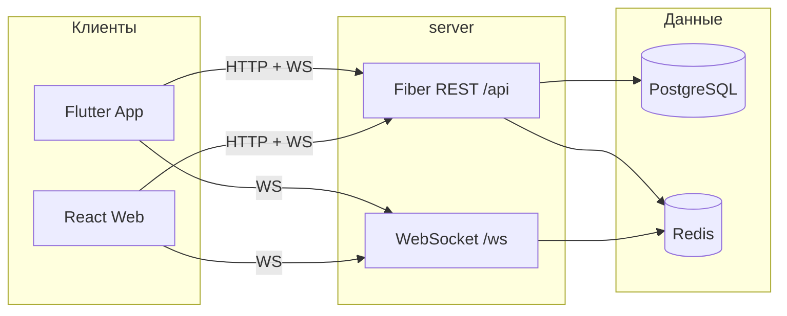

# Telegram Clone

Монорепозиторий мессенджера в стиле Telegram: мобильный клиент (Flutter), веб-клиент (React) и общий бэкенд (Go).

## Состав

| Каталог | Стек | Назначение |
| --- | --- | --- |
| [`App/`](App/) | Flutter (Android) | Мобильное приложение |
| [`Web/`](Web/) | React 19, Vite, Zustand | Веб-клиент |
| [`server/`](server/) | Go, Fiber, PostgreSQL, Redis | REST API + WebSocket |
| [`design/`](design/) | JSON + Node generator | Общая дизайн-система (токены) |

Оба клиента работают с **одним** API:

- REST: `/api/*` (аутентификация, пользователи, чаты, сообщения)
- WebSocket: `/ws` (сообщения в реальном времени, печатание, онлайн, прочтение)
- Медиа: `/uploads/*` (JWT или `?t=` для тегов без заголовка Authorization)

## Архитектура



PostgreSQL хранит пользователей, чаты и сообщения. Redis — сессии, pub/sub для WebSocket и rate limit.

## Быстрый старт

### 1. Инфраструктура (PostgreSQL + Redis)

```bash
cd server
docker compose up -d
```

Опционально pgAdmin: `docker compose --profile tools up -d` → http://localhost:5050

### 2. API-сервер

```bash
cd server
cp .env.example .env   # при необходимости
go mod tidy
go run cmd/main.go
```

Сервер по умолчанию: `http://localhost:8080`  
WebSocket: `ws://localhost:8080/ws?token=<access_token>`

В режиме `ENV=development` OTP-коды выводятся в консоль, если SMTP не настроен.

### 3. Flutter (Android)

```bash
cd App
flutter pub get
flutter run \
  --dart-define=API_BASE_URL=http://10.0.2.2:8080 \
  --dart-define=WS_URL=ws://10.0.2.2:8080/ws
```

На физическом устройстве укажите LAN IP хоста вместо `10.0.2.2`.

Подробнее: [`App/README.md`](App/README.md)

### 4. Web

```bash
cd Web
npm install
cp .env.example .env
npm run dev
```

Dev-сервер: http://localhost:5173 (прокси `/api`, `/uploads`, `/ws` → `:8080`).

Подробнее: [`Web/README.md`](Web/README.md)

## Возможности

- **Аутентификация по email + OTP** — отправка кода, верификация, заполнение профиля для новых пользователей
- **Личные и групповые чаты** — создание, участники, аватары
- **Сообщения** — текст, фото, видео, файлы, голосовые; ответы, редактирование, удаление, пересылка, закрепы
- **Realtime** — WebSocket: новые сообщения, печатание, онлайн, прочтение
- **1:1 звонки** — WebRTC (голос / видео) через сигналинг `call.offer|answer|ice|end`
- **Push** — FCM / локальные уведомления; токен: `POST /api/devices/push-token`
- **Профиль и настройки** — аватар, тема (светлая / тёмная), уведомления
- **Поиск** — пользователи и сообщения в чате

## Аутентификация (кратко)

| Шаг | Endpoint | Описание |
| --- | --- | --- |
| 1 | `POST /api/auth/send-code` | OTP на email |
| 2 | `POST /api/auth/verify-code` | Вход или `registration_token` для нового |
| 3 | `POST /api/auth/complete-profile` | Профиль нового пользователя (Bearer registration token) |
| — | `POST /api/auth/refresh` | Обновление access token |
| — | `POST /api/auth/logout` | Выход |

## Документация

- [App/README.md](App/README.md) — Flutter-клиент
- [Web/README.md](Web/README.md) — веб-клиент
- [server/README.md](server/README.md) — Go API
- [design/README.md](design/README.md) — токены и генерация

## Дизайн-система

Токены в [`design/tokens.json`](design/tokens.json). Регенерация:

```bash
node design/generate.mjs
```

Обновляет `App/lib/core/generated/tokens.dart` и `Web/src/styles/tokens.css`.
